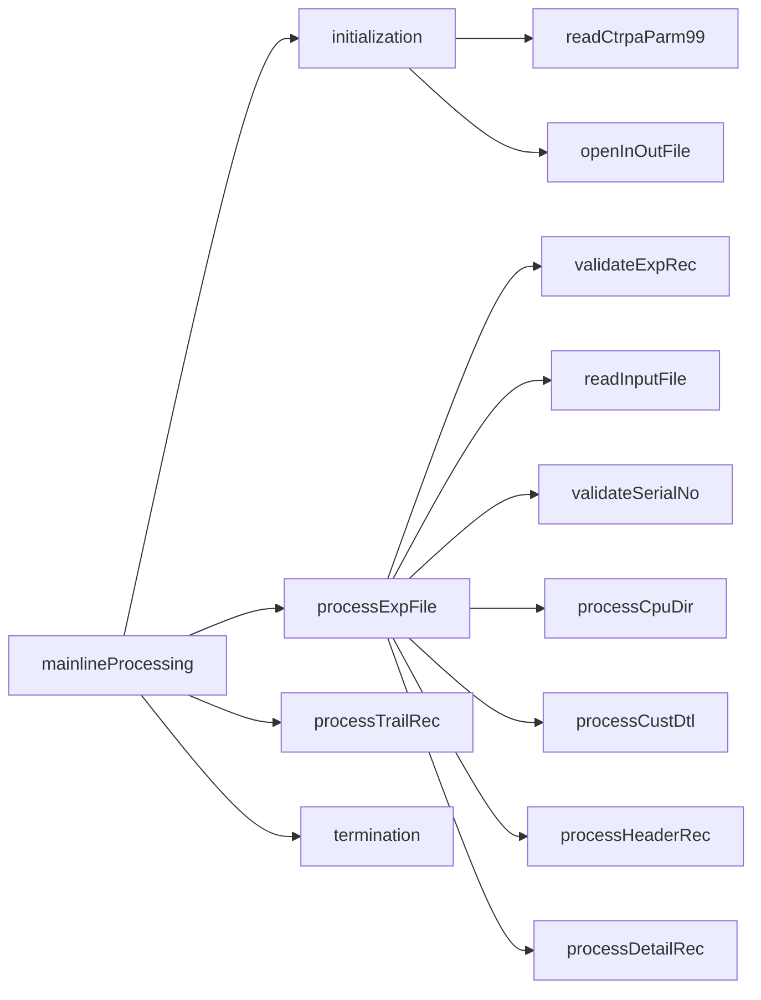

# 📊 COBOL Program Analysis: YK185

## 🔍 Overview
- **Program Name**: YK185
- **Total Procedures**: 16
- **Total Statements**: 277

## 🗺️ Program Flow Overview

```mermaid
flowchart TD
    START(["🚀 YK185"])

    validateExpRec["📋 validateExpRec"]
    processHeaderRec["⚡ processHeaderRec"]
    termination(["🏁 termination"])
    processCpuDir["⚡ processCpuDir"]
    processExpFile[["📁 processExpFile"]]
    readCtrpaParm99[["📁 readCtrpaParm99"]]
    processDetailRec["⚡ processDetailRec"]
    processTrailRec["⚡ processTrailRec"]
    readInputFile[["📁 readInputFile"]]
    openInOutFile[["📁 openInOutFile"]]
    mainlineProcessing["🏗️ mainlineProcessing"]
    initialization("⚙️ initialization")
    validateSerialNo["📋 validateSerialNo"]
    processCustDtl["⚡ processCustDtl"]
    endRead[["📁 endRead"]]
    FILE[["📁 FILE"]]

    START --> validateExpRec
    processExpFile --> validateExpRec
    processExpFile --> readInputFile
    processExpFile --> validateSerialNo
    processExpFile --> processCpuDir
    processExpFile --> processCustDtl
    processExpFile --> processHeaderRec
    processExpFile --> processDetailRec
    mainlineProcessing --> initialization
    mainlineProcessing --> processExpFile
    mainlineProcessing --> processTrailRec
    mainlineProcessing --> termination
    initialization --> readCtrpaParm99
    initialization --> openInOutFile

    classDef programNode fill:#ff4444,stroke:#cc0000,stroke-width:3px,color:#fff
    classDef procedureNode fill:#ff6b6b,stroke:#cc2222,stroke-width:2px,color:#fff

    class START programNode
    class validateExpRec procedureNode
    class processHeaderRec procedureNode
    class termination procedureNode
    class processCpuDir procedureNode
    class processExpFile procedureNode
    class readCtrpaParm99 procedureNode
    class processDetailRec procedureNode
    class processTrailRec procedureNode
    class readInputFile procedureNode
    class openInOutFile procedureNode
    class mainlineProcessing procedureNode
    class initialization procedureNode
    class validateSerialNo procedureNode
    class processCustDtl procedureNode
    class endRead procedureNode
    class FILE procedureNode
```



## 📋 Procedure Statistics

| Procedure | Statements | PERFORM Calls | Key Operations |
|-----------|------------|---------------|----------------|
| validateExpRec | 104 | 0 | CONTROL:32, DATA:67, SQL:2, VALIDATION:3 |
| processHeaderRec | 13 | 0 | DATA:13 |
| termination | 14 | 0 | CONTROL:4, DATA:7, FILE:2, SQL:1 |
| processCpuDir | 42 | 0 | DATA:35, SQL:4, VALIDATION:3 |
| processExpFile | 14 | 7 | CONTROL:13, DATA:1 |
| readCtrpaParm99 | 18 | 0 | DATA:15, SQL:2, VALIDATION:1 |
| processDetailRec | 30 | 0 | DATA:30 |
| processTrailRec | 8 | 0 | DATA:8 |
| readInputFile | 7 | 0 | CONTROL:1, DATA:5, FILE:1 |
| openInOutFile | 7 | 0 | CONTROL:3, DATA:2, FILE:2 |
| mainlineProcessing | 8 | 4 | CONTROL:6, DATA:2 |
| initialization | 8 | 2 | CONTROL:2, DATA:6 |
| validateSerialNo | 0 | 0 |  |
| processCustDtl | 0 | 0 |  |
| endRead | 0 | 0 |  |
| FILE | 4 | 0 | DATA:4 |

## 🔬 Detailed Procedure Flows

### 📌 validateExpRec

```mermaid
flowchart TD
    START(["📋 validateExpRec"])

    S1["⚙️ Init mxaw185iRec"]
    START --> S1
    S2["⚡ INSPECT wsExpInRecord"]
    S1 --> S2
    S3{"wsCommaCount NOT = 14?"}
    S2 --> S3
    S4["🔧 invalidRecFormat      ..."]
    S3 --> S4
    S5["⚡ END-IF."]
    S4 --> S5
    S6["⚡ UNSTRING wsExpInRecord..."]
    S5 --> S6
    S7{"mxaw185iCpuId NOT = ws...?"}
    S6 --> S7
    S8["🔧 invalidRecFormat      ..."]
    S7 --> S8
    S9["⚡ END-IF."]
    S8 --> S9
    S10{"mxaw185iVinNo = 'N/A'?"}
    S9 --> S10
    S11["🔧 invalidRecFormat      ..."]
    S10 --> S11
    S12["⚡ END-IF."]
    S11 --> S12
    S13{"mxaw185iDateOfTran    ...?"}
    S12 --> S13
    S14["📦 wsSysDate            T..."]
    S13 --> S14
    S15["⚡ END-IF."]
    S14 --> S15
    S16{"mxaw185iVehRegMark    ...?"}
    S15 --> S16
    S17["📦 SPACES               T..."]
    S16 --> S17
    S18["⚡ END-IF."]
    S17 --> S18
    S19{"mxaw185iMfgMake       ...?"}
    S18 --> S19
    S20["📦 SPACES               T..."]
    S19 --> S20
    S21["⚡ END-IF."]
    S20 --> S21
    S22{"mxaw185iModel         ...?"}
    S21 --> S22
    S23["📦 SPACES               T..."]
    S22 --> S23
    S24["⚡ END-IF."]
    S23 --> S24
    S25{"mxaw185iFirstRegDt    ...?"}
    S24 --> S25
    S26["📦 wsDefaultDate        T..."]
    S25 --> S26
    S27["⚡ END-IF."]
    S26 --> S27
    S28["📦 FUNCTION TRIM(wsPrevKe..."]
    S27 --> S28
    S29["⚡ INSPECT wsPrevKeepNoCha"]
    S28 --> S29
    S30{"wsPrevKeepNoCha IS NUM...?"}
    S29 --> S30
    S31["📦 wsPrevKeepNoNum      T..."]
    S30 --> S31
    S32["📦 ZEROES               T..."]
    S31 --> S32
    S33["⚡ END-IF."]
    S32 --> S33
    S34{"mxaw185iLastKeepChqDt ...?"}
    S33 --> S34
    S35["📦 wsDefaultDate        T..."]
    S34 --> S35
    S36["⚡ END-IF."]
    S35 --> S36
    S37{"mxaw185iFinCompany    ...?"}
    S36 --> S37
    S38["📦 SPACES               T..."]
    S37 --> S38
    S39["⚡ END-IF."]
    S38 --> S39
    S40{"mxaw185iContactNo     ...?"}
    S39 --> S40
    S41["📦 SPACES               T..."]
    S40 --> S41
    S42["⚡ END-IF."]
    S41 --> S42
    S43{"mxaw185iAgreementNo   ...?"}
    S42 --> S43
    S44["📦 SPACES               T..."]
    S43 --> S44
    S45["⚡ END-IF."]
    S44 --> S45
    S46{"mxaw185iAgreementType ...?"}
    S45 --> S46
    S47["📦 SPACES               T..."]
    S46 --> S47
    S48["⚡ END-IF."]
    S47 --> S48
    S49{"mxaw185iAgreementDate ...?"}
    S48 --> S49
    S50["📦 wsDefaultDate        T..."]
    S49 --> S50
    S51["⚡ END-IF."]
    S50 --> S51
    S52{"mxaw185iAgreementTerm ...?"}
    S51 --> S52
    S53["📦 SPACES               T..."]
    S52 --> S53
    S54["⚡ END-IF."]
    S53 --> S54
    S55["⚙️ Init DCLVWMTRLI"]
    S54 --> S55
    S56["📦 mxaw185iVinNo         ..."]
    S55 --> S56
    S57[("💾 ")]
    S56 --> S57
    S58["⚡ END-EXEC."]
    S57 --> S58
    S59{"SQLCODE"}
    S58 --> S59
    S59 --> END(["✅ Complete"])

    classDef controlNode fill:#4a90e2,stroke:#2171b5,stroke-width:2px,color:#fff
    class S3 S5 S7 S9 S10 S12 S13 S15 S16 S18 S19 S21 S22 S24 S25 S27 S30 S33 S34 S36 S37 S39 S40 S42 S43 S45 S46 S48 S49 S51 S52 S54 controlNode
    classDef dataNode fill:#7ed321,stroke:#5cb85c,stroke-width:2px,color:#fff
    class S1 S4 S6 S8 S11 S14 S17 S20 S23 S26 S28 S31 S32 S35 S38 S41 S44 S47 S50 S53 S55 S56 dataNode
    classDef sqlNode fill:#9013fe,stroke:#7b1fa2,stroke-width:2px,color:#fff
    class S57 S58 sqlNode
    classDef validationNode fill:#ff9500,stroke:#e65100,stroke-width:2px,color:#fff
    class S2 S29 S59 validationNode
    classDef programNode fill:#ff4444,stroke:#cc0000,stroke-width:3px,color:#fff
    class START END programNode
```

### 📌 processHeaderRec

```mermaid
flowchart TD
    START(["📋 processHeaderRec"])

    S1["⚙️ Init mxaw185oHExpHdrRec."]
    START --> S1
    S2["🔧 mxaw185oHHdrRec       ..."]
    S1 --> S2
    S3["🔧 mxaw185oHDocData      ..."]
    S2 --> S3
    S4["⚡ ADD 1                 ..."]
    S3 --> S4
    S5["📦 wsSaveIntNoLast4      ..."]
    S4 --> S5
    S6["📦 wsCpuCode             ..."]
    S5 --> S6
    S7["📦 wsDate1               ..."]
    S6 --> S7
    S8["⚡ ACCEPT wsSystemTime   ..."]
    S7 --> S8
    S9["📦 wsSystemTime(1:2)     ..."]
    S8 --> S9
    S10["📦 wsSystemTime(3:2)     ..."]
    S9 --> S10
    S11["📦 wsTime                ..."]
    S10 --> S11
    S12["📦 charDataText(1:charDat..."]
    S11 --> S12
    S12 --> END(["✅ Complete"])

    classDef dataNode fill:#7ed321,stroke:#5cb85c,stroke-width:2px,color:#fff
    class S1 S2 S3 S4 S5 S6 S7 S8 S9 S10 S11 S12 dataNode
    classDef programNode fill:#ff4444,stroke:#cc0000,stroke-width:3px,color:#fff
    class START END programNode
```

### 📌 termination

```mermaid
flowchart TD
    START(["📋 termination"])

    S1[["CLOSE CLOSE customerInFile."]]
    START --> S1
    S2{"wsExpInFileStatus = '00'?"}
    S1 --> S2
    S3["📦 wsPgmName           TO..."]
    S2 --> S3
    S4["⚡ END-IF."]
    S3 --> S4
    S5[["CLOSE CLOSE customerOutFile."]]
    S4 --> S5
    S6{"wsExpOutFileStatus = '00'?"}
    S5 --> S6
    S7["📦 wsPgmName           TO..."]
    S6 --> S7
    S8["⚡ END-IF."]
    S7 --> S8
    S9[("💾 ")]
    S8 --> S9
    S9 --> END(["✅ Complete"])

    classDef controlNode fill:#4a90e2,stroke:#2171b5,stroke-width:2px,color:#fff
    class S2 S4 S6 S8 controlNode
    classDef dataNode fill:#7ed321,stroke:#5cb85c,stroke-width:2px,color:#fff
    class S3 S7 dataNode
    classDef fileNode fill:#f5a623,stroke:#e08e0b,stroke-width:2px,color:#fff
    class S1 S5 fileNode
    classDef sqlNode fill:#9013fe,stroke:#7b1fa2,stroke-width:2px,color:#fff
    class S9 sqlNode
    classDef programNode fill:#ff4444,stroke:#cc0000,stroke-width:3px,color:#fff
    class START END programNode
```

### 📌 processCpuDir

```mermaid
flowchart TD
    START(["📋 processCpuDir"])

    S1["⚙️ Init DCLVWMCUCP."]
    START --> S1
    S2["🔧 dlrXrefNotFound       ..."]
    S1 --> S2
    S3[("💾 ")]
    S2 --> S3
    S4["⚡ END-EXEC."]
    S3 --> S4
    S5{"SQLCODE"}
    S4 --> S5
    S6["🔧 dlrXrefFound     TO TRUE"]
    S5 --> S6
    S7["⚡ ADD 1                T..."]
    S6 --> S7
    S8["🔧 dlrXrefDup       TO TRUE"]
    S7 --> S8
    S9["🔧 dlrXrefNotFound  TO TRUE"]
    S8 --> S9
    S10["⚡ END-EVALUATE."]
    S9 --> S10
    S11["📦 SPACES                ..."]
    S10 --> S11
    S12[("💾 ")]
    S11 --> S12
    S13["⚡ END-EXEC."]
    S12 --> S13
    S14{"SQLCODE"}
    S13 --> S14
    S14 --> END(["✅ Complete"])

    classDef dataNode fill:#7ed321,stroke:#5cb85c,stroke-width:2px,color:#fff
    class S1 S2 S6 S7 S8 S9 S11 dataNode
    classDef sqlNode fill:#9013fe,stroke:#7b1fa2,stroke-width:2px,color:#fff
    class S3 S4 S12 S13 sqlNode
    classDef validationNode fill:#ff9500,stroke:#e65100,stroke-width:2px,color:#fff
    class S5 S10 S14 validationNode
    classDef programNode fill:#ff4444,stroke:#cc0000,stroke-width:3px,color:#fff
    class START END programNode
```

### 📌 processExpFile

```mermaid
flowchart TD
    START(["📋 processExpFile"])

    S1["📦 'Y'                   ..."]
    START --> S1
    S2["🔄 Call validateExpRec"]
    S1 --> S2
    S3{"invalidRecFormat?"}
    S2 --> S3
    S4["🔄 Call readInputFile"]
    S3 --> S4
    S5["⚡ END-IF."]
    S4 --> S5
    S6["🔄 Call validateSerialNo"]
    S5 --> S6
    S7["🔄 Call processCpuDir"]
    S6 --> S7
    S8["⚡ END-IF."]
    S7 --> S8
    S9["🔄 Call processCustDtl"]
    S8 --> S9
    S10{"wsTotalRecsValid = 1?"}
    S9 --> S10
    S11["🔄 Call processHeaderRec"]
    S10 --> S11
    S12["⚡ END-IF"]
    S11 --> S12
    S13["🔄 Call processDetailRec"]
    S12 --> S13
    S14["⚡ END-IF."]
    S13 --> S14
    S14 --> END(["✅ Complete"])

    classDef controlNode fill:#4a90e2,stroke:#2171b5,stroke-width:2px,color:#fff
    class S2 S3 S4 S5 S6 S7 S8 S9 S10 S11 S12 S13 S14 controlNode
    classDef dataNode fill:#7ed321,stroke:#5cb85c,stroke-width:2px,color:#fff
    class S1 dataNode
    classDef programNode fill:#ff4444,stroke:#cc0000,stroke-width:3px,color:#fff
    class START END programNode
```

### 📌 readCtrpaParm99

```mermaid
flowchart TD
    START(["📋 readCtrpaParm99"])

    S1["⚙️ Init DCLVWMCTRPA"]
    START --> S1
    S2[("💾 ")]
    S1 --> S2
    S3["⚡ END-EXEC."]
    S2 --> S3
    S4{"SQLCODE"}
    S3 --> S4
    S5["📦 integerNo OF DCLVWMCTRPA"]
    S4 --> S5
    S6["📦 wsPgmName   TO abtPgmName"]
    S5 --> S6
    S7["🔧 abtErrorIsDb2 TO TRUE"]
    S6 --> S7
    S7 --> END(["✅ Complete"])

    classDef dataNode fill:#7ed321,stroke:#5cb85c,stroke-width:2px,color:#fff
    class S1 S5 S6 S7 dataNode
    classDef sqlNode fill:#9013fe,stroke:#7b1fa2,stroke-width:2px,color:#fff
    class S2 S3 sqlNode
    classDef validationNode fill:#ff9500,stroke:#e65100,stroke-width:2px,color:#fff
    class S4 validationNode
    classDef programNode fill:#ff4444,stroke:#cc0000,stroke-width:3px,color:#fff
    class START END programNode
```

### 📌 processDetailRec

```mermaid
flowchart TD
    START(["📋 processDetailRec"])

    S1["⚙️ Init mxaw185oDExpDtlRec."]
    START --> S1
    S2["🔧 mxaw185oDDtlRec       ..."]
    S1 --> S2
    S3["⚡ ADD 1                 ..."]
    S2 --> S3
    S4["📦 wsSaveIntNoLast4      ..."]
    S3 --> S4
    S5["📦 dlrNo OF DCLVWMTRLI   ..."]
    S4 --> S5
    S6["📦 trustNo OF DCLVWMTRLI ..."]
    S5 --> S6
    S7["📦 wsCpuCode             ..."]
    S6 --> S7
    S8["📦 wsDate1               ..."]
    S7 --> S8
    S9["📦 wsTime                ..."]
    S8 --> S9
    S10["📦 cpuDealerNo OF DCLVWMCUCP"]
    S9 --> S10
    S11["📦 legalNameText OF DCLVW..."]
    S10 --> S11
    S12["📦 modelNo OF DCLVWMTRLI ..."]
    S11 --> S12
    S13["📦 mxaw185iModel         ..."]
    S12 --> S13
    S14["📦 serialNo OF DCLVWMTRLI..."]
    S13 --> S14
    S15["📦 mxaw185iFirstRegDt    ..."]
    S14 --> S15
    S16["📦 distNo  OF DCLVWMTRLI ..."]
    S15 --> S16
    S17["📦 wsSaveDistNoLast6     ..."]
    S16 --> S17
    S18["📦 mxaw185iDateOfTran    ..."]
    S17 --> S18
    S19["📦 mxaw185iVehRegMark    ..."]
    S18 --> S19
    S20["📦 mxaw185iMfgMake       ..."]
    S19 --> S20
    S21["📦 mxaw185iPrevKeepNo    ..."]
    S20 --> S21
    S22["📦 mxaw185iLastKeepChqDt ..."]
    S21 --> S22
    S23["📦 mxaw185iFinCompany    ..."]
    S22 --> S23
    S24["📦 mxaw185iContactNo     ..."]
    S23 --> S24
    S25["📦 mxaw185iAgreementNo   ..."]
    S24 --> S25
    S26["📦 mxaw185iAgreementType ..."]
    S25 --> S26
    S27["📦 mxaw185iAgreementDate ..."]
    S26 --> S27
    S28["📦 mxaw185iAgreementTerm ..."]
    S27 --> S28
    S28 --> END(["✅ Complete"])

    classDef dataNode fill:#7ed321,stroke:#5cb85c,stroke-width:2px,color:#fff
    class S1 S2 S3 S4 S5 S6 S7 S8 S9 S10 S11 S12 S13 S14 S15 S16 S17 S18 S19 S20 S21 S22 S23 S24 S25 S26 S27 S28 dataNode
    classDef programNode fill:#ff4444,stroke:#cc0000,stroke-width:3px,color:#fff
    class START END programNode
```

### 📌 processTrailRec

```mermaid
flowchart TD
    START(["📋 processTrailRec"])

    S1["⚙️ Init mxaw185oZExpTrlRec."]
    START --> S1
    S2["📦 1                     ..."]
    S1 --> S2
    S3["🔧 mxaw185oZTrlRec       ..."]
    S2 --> S3
    S4["📦 wsSaveIntNoLast4      ..."]
    S3 --> S4
    S5["📦 wsCpuCode             ..."]
    S4 --> S5
    S6["📦 wsDate1               ..."]
    S5 --> S6
    S7["📦 wsTime                ..."]
    S6 --> S7
    S8["📦 wsTotDtlRecCnt        ..."]
    S7 --> S8
    S8 --> END(["✅ Complete"])

    classDef dataNode fill:#7ed321,stroke:#5cb85c,stroke-width:2px,color:#fff
    class S1 S2 S3 S4 S5 S6 S7 S8 dataNode
    classDef programNode fill:#ff4444,stroke:#cc0000,stroke-width:3px,color:#fff
    class START END programNode
```

### 📌 readInputFile

```mermaid
flowchart TD
    START(["📋 readInputFile"])

    S1[["📖 READ customerInFile"]]
    START --> S1
    S2["🔧 wsEndOfFile      TO TRUE"]
    S1 --> S2
    S3["⚡ ADD +1           TO ws..."]
    S2 --> S3
    S4{"wsExpInFileStatus GREA...?"}
    S3 --> S4
    S4 --> END(["✅ Complete"])

    classDef controlNode fill:#4a90e2,stroke:#2171b5,stroke-width:2px,color:#fff
    class S4 controlNode
    classDef dataNode fill:#7ed321,stroke:#5cb85c,stroke-width:2px,color:#fff
    class S2 S3 dataNode
    classDef fileNode fill:#f5a623,stroke:#e08e0b,stroke-width:2px,color:#fff
    class S1 fileNode
    classDef programNode fill:#ff4444,stroke:#cc0000,stroke-width:3px,color:#fff
    class START END programNode
```

### 📌 openInOutFile

```mermaid
flowchart TD
    START(["📋 openInOutFile"])

    S1[["OPEN OPEN INPUT  customerIn..."]]
    START --> S1
    S2{"wsExpInFileStatus GREA...?"}
    S1 --> S2
    S3["📦 wsPgmName           TO..."]
    S2 --> S3
    S4["⚡ END-IF."]
    S3 --> S4
    S5[["OPEN OPEN OUTPUT customerOu..."]]
    S4 --> S5
    S6{"wsExpOutFileStatus GRE...?"}
    S5 --> S6
    S7["📦 wsPgmName           TO..."]
    S6 --> S7
    S7 --> END(["✅ Complete"])

    classDef controlNode fill:#4a90e2,stroke:#2171b5,stroke-width:2px,color:#fff
    class S2 S4 S6 controlNode
    classDef dataNode fill:#7ed321,stroke:#5cb85c,stroke-width:2px,color:#fff
    class S3 S7 dataNode
    classDef fileNode fill:#f5a623,stroke:#e08e0b,stroke-width:2px,color:#fff
    class S1 S5 fileNode
    classDef programNode fill:#ff4444,stroke:#cc0000,stroke-width:3px,color:#fff
    class START END programNode
```

### 📌 mainlineProcessing

```mermaid
flowchart TD
    START(["📋 mainlineProcessing"])

    S1["🔄 Call initialization"]
    START --> S1
    S2["🔄 Call processExpFile"]
    S1 --> S2
    S3{"wsTotalRecsValid >= 1 ...?"}
    S2 --> S3
    S4["🔄 Call processTrailRec"]
    S3 --> S4
    S5["⚡ END-IF."]
    S4 --> S5
    S6["🔄 Call termination"]
    S5 --> S6
    S6 --> END(["✅ Complete"])

    classDef controlNode fill:#4a90e2,stroke:#2171b5,stroke-width:2px,color:#fff
    class S1 S2 S3 S4 S5 S6 controlNode
    classDef programNode fill:#ff4444,stroke:#cc0000,stroke-width:3px,color:#fff
    class START END programNode
```

### 📌 initialization

```mermaid
flowchart TD
    START(["📋 initialization"])

    S1["📦 wsPgmName             ..."]
    START --> S1
    S2["⚙️ Init wsCountFields."]
    S1 --> S2
    S3["⚡ ACCEPT wsSysDate FROM ..."]
    S2 --> S3
    S4["📦 wsSysYYYV             ..."]
    S3 --> S4
    S5["📦 wsSysMm               ..."]
    S4 --> S5
    S6["📦 wsSysDd               ..."]
    S5 --> S6
    S7["🔄 Call readCtrpaParm99"]
    S6 --> S7
    S8["🔄 Call openInOutFile"]
    S7 --> S8
    S8 --> END(["✅ Complete"])

    classDef controlNode fill:#4a90e2,stroke:#2171b5,stroke-width:2px,color:#fff
    class S7 S8 controlNode
    classDef dataNode fill:#7ed321,stroke:#5cb85c,stroke-width:2px,color:#fff
    class S1 S2 S3 S4 S5 S6 dataNode
    classDef programNode fill:#ff4444,stroke:#cc0000,stroke-width:3px,color:#fff
    class START END programNode
```

### 📌 FILE

```mermaid
flowchart TD
    START(["📋 FILE"])


    classDef programNode fill:#ff4444,stroke:#cc0000,stroke-width:3px,color:#fff
    class START END programNode
```

## 🔗 PERFORM Call Relationships


